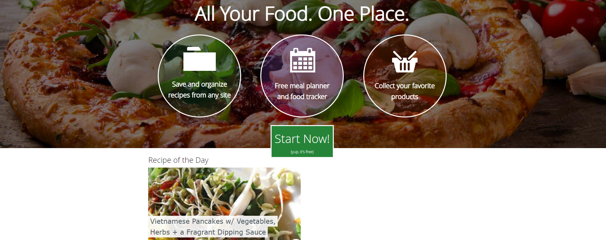

<h2> Проект по тестированию UI и API Spoonacular 
<h2> Cайта, позволяющего выбирать и создавать рецепты, планы питания, управлять продуктовой корзиной и многое другое </h2>

> <a target="_blank" href="https://spoonacular.com/">Ссылка на сайт</a>



<h3> Список проверок, реализованных в автотестах:</h3>

### UI-тесты
- [x] Проверка заголовков и url на главной странице
- [x] Авторизация пользователя на сайте (успешная и неуспешная)
- [x] Запрос на отправку ссылки на восстановление пароля
- [x] Неуспешная регистрация без капчи
- [x] Добавление и удаление кастомной еды

### API-тесты
- [x] Получение username и hash для юзера
- [x] Отправка запроса неавторизованным пользователем (без ключа, с несуществующим ключом)
- [x] Поиск рецепта по ингредиенту (в т.ч. несуществующему)
- [x] Получение инфо по ингредиенту (в т.ч. по невалидному id)
- [x] Расчет гликемического индекса
- [x] Создание плана меню (на день, на неделю, с ограничением калорий)
- [x] Расчет гликемического индекса
- [x] Поиск рецепта (в т.ч. поиск похожего рецепта)
- [x] Добавление и удаление из списка покупок

## Структура проекта
### Проект реализован с использованием
|                                      Python                                       |                                      Pytest                                       |                                       PyCharm                                       |                                   Selene                                    |                                       Jenkins                                       |                              Allure Report                               |                                      Allure TestOps                                      |                                   Telegram                                   |
|:---------------------------------------------------------------------------------:|:---------------------------------------------------------------------------------:|:-----------------------------------------------------------------------------------:|:---------------------------------------------------------------------------:|:-----------------------------------------------------------------------------------:|:------------------------------------------------------------------------:|:----------------------------------------------------------------------------------------:|:----------------------------------------------------------------------------:|
|  |  |  |     |  |  |  |  |


## Локальный запуск автотестов
### Для локального запуска с дефолтными значениями необходимо выполнить команду:
```
python -m venv .venv
source .venv/bin/activate
pip install poetry
poetry install --no-root
pytest tests
```

## Удаленный запуск автотестов выполняется на сервере Jenkins
> <a target="_blank" href="https://jenkins.autotests.cloud/job/spoonacular_test_project/">Ссылка на проект в Jenkins</a>

### Для запуска автотестов в Jenkins
1. Открыть <a target="_blank" href="https://jenkins.autotests.cloud/job/spoonacular_test_project/">проект</a>
2. Выбрать пункт `Build with Parameters`
3. Указать комментарий
4. Нажать кнопку `Build`
5. Результат запуска сборки можно посмотреть в отчёте Allure

